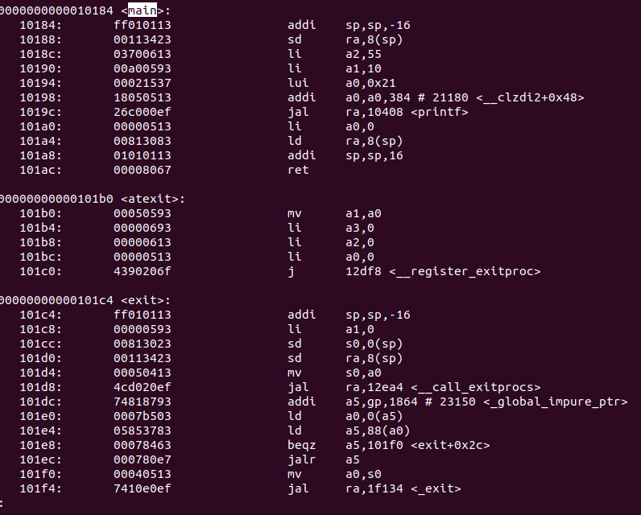
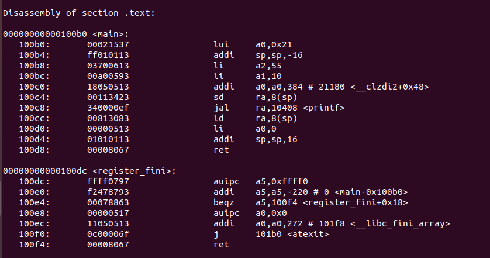
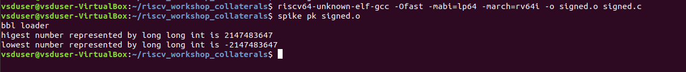
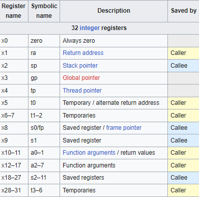
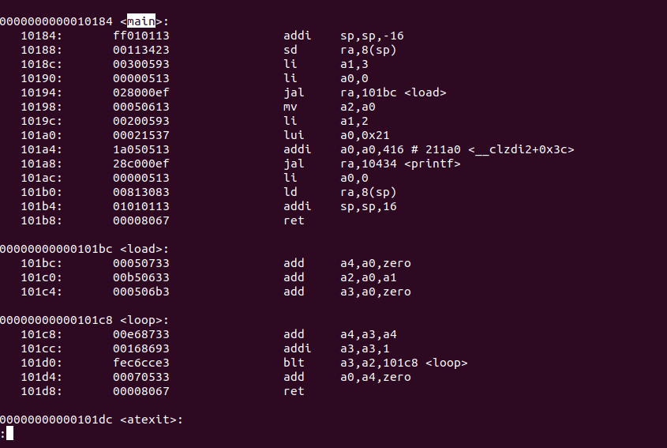
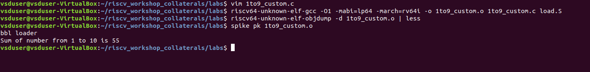
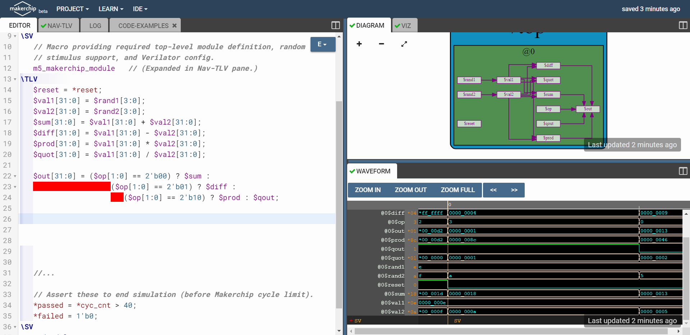
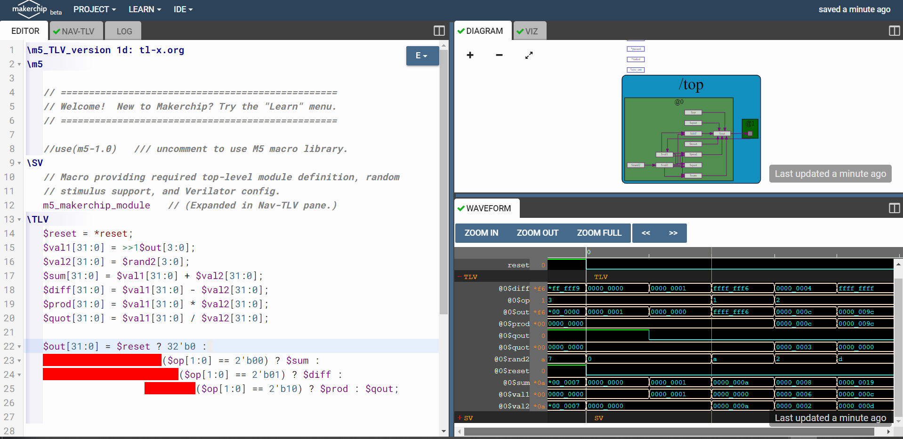
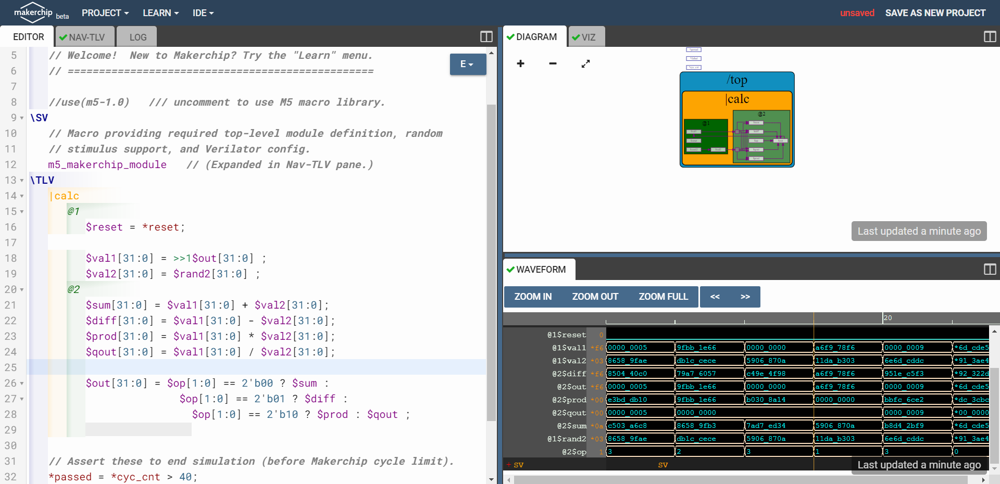

# RISC-V-MYTH-Workshop

  This repository includes all the studies and the skills that have beed gained during the [RISC-V based MYTH](https://www.vlsisystemdesign.com/riscv-based-myth/) workshop , that talking about bulding RISC-V piplined core which has support of base interger RV32I using hardware programming langauge called TL-verilog on makerchip platfor

# Table of Contents
- [Day1](##Day1) 
    - [Introduction to RISC-V ISA](###introduction-to-risc-v-isa)
    - [RISC-V software toolchain](###RISC-V-software-toolchain)
    - [Workshop results](###Workshop-results)
- [Day 2](##Day2)
    - [Introduction to Application Binary Interface (ABI)](###introduction-Application-Binary-Interface-(ABI)) 
- [Day 3](##Day3)
    - [TL-Verilog and Makership](###TL-Verilog-and-Makership)
    - [Combinational logic](###Combinational-logic)
    - [Sequential logic](###Sequential-logic)
    - [Pipelined logic](###Pipelined-logic)
    - 
## Day 1
  ### introduction-to-risc-v-isa
  The RISC-V instruction set architecture (ISA) is is an open standard instruction set architecture (ISA) based on established reduced instruction set computer (RISC) principles. Unlike most other ISA designs, RISC-V is provided under royalty-free open-source licenses
  ### RISC-V software toolchain 
  there is a several ways for programmers to make and compile and reviwe each code they are programming in linux system .
  1. the simple way and its by using `gcc <file name > ` this command creating for us output file that contains the results .
  2. the Risc-V toolchain witch is not only provide compiler but also have several command that can be useful .
   * risc-v gcc compiler use the below commands:
     
     `riscv64-unknown-elf-gcc -Ofast -mabi=lp64 -march=rv64i -o <object filename> <C filename>` 
    
      `riscv64-unknown-elf-gcc -O1 -mabi=lp64 -march=rv64i -o <object filename> <C filename>`
     
      also it have more options for `-mabi` and `-march`

  * To view assembly code use the below command,
    
     `riscv64-unknown-elf-objdump -d <object filename>`

  * To use SPIKE simualtor to run risc-v obj file use the below command,
  
    `spike pk <object filename>`
    
    To use SPIKE as debugger
    
    `spike -d pk <object Filename>` with degub command as `until pc 0 <pc of your choice>`

     ### Workshop results
      First we programmed a C-code that give us the sum from 1 to n
    
      

      then we compiled it in the simple way
    
      

      the assembly code was

    

    and if we run the `-Ofast` option of the risc-v gcc compiler we will have
    
    

    and if we use `spike`
    
    

    
## Day 2
    
  ### introduction Application Binary Interface (ABI)    
  
An Application Binary Interface (ABI) represents a collection of regulations that the Operating System upholds for a particular computing architecture. Consequently, the Linker is responsible for transforming relocatable machine code into absolute machine code by adhering to the ABI interface that aligns with the given machine's architecture.

The system call interface serves as the means through which an application program can interact with architecture-specific registers. In the context of RISC-V architecture, which encompasses 32 or 64 registers, a predefined table outlines the calling convention assigned to these registers, offering application programmers a structured approach for their utilization.

### Workshop results
the image below contains the `main` code and the `load`

and then the sum will be :

## Day 3
### TL-Verilog and Makership
Our workshop was basicly talkking about buliding a risc-v core so to do it we need a platform , so we used [Makerchip](https://makerchip.com/) it is a free online environment for developing high-quality integrated circuits. by using it we can code,compile,simulate and debug verilog codes . 
This platfrom supports also TL-verilog the used language in this workshop . We will be coding a basic claculator to learn TL-verilog and see how the platform works .

### Combinational logic
First we will start with basic with is the Combinational logic we started with practicing in the not gate `$out = !$in` then we moved to code simple calculator that takes 2 inputs then sum,diff,prod and qout them and the output will be chosen by mux .

### Sequential logic
the Sequential logic is basicly the dependency of the inputs on the previous outputs of the design in our code we changed the `$val1[31:0] = rand1[31:0]` to `$val1[31:0] = >>1$out[31:0]` the `>>1` used to indactae to the previous value of any value we need

### Pipelined logic

Timing abstract powerful feature of TL-Verilog which converts a code into pipeline stages easily. Whole code under `|pipeline` scope with stages defined by `@?`. 
by divide the code to stages we can run more than one command in the same time witch will be very uselful to for time reduction 

 

